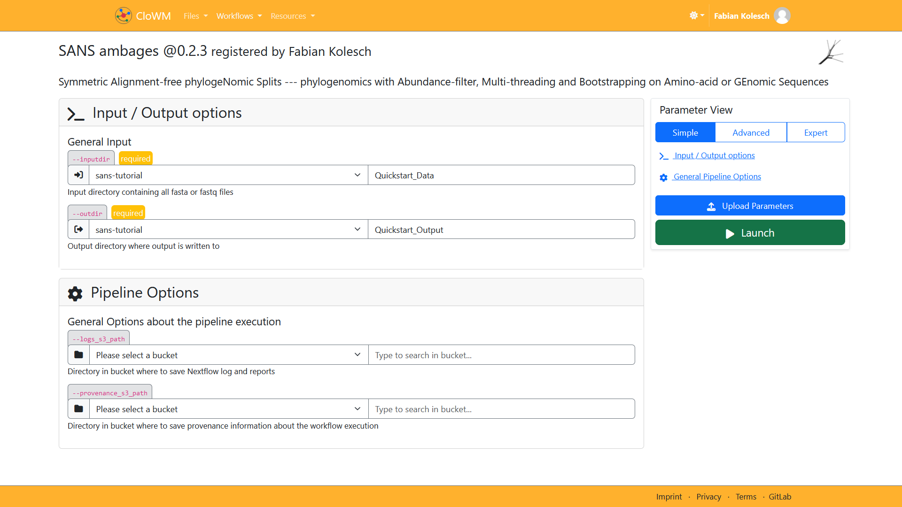

[comment]: <> (Author: Fabian Kolesch)
[comment]: <> (This document contains the html usage guide for SANS in the CloWM environment)

<head>
    <style>
        /* 
        This section defines basic style rules and classes.
        The arrangement of the dokument follows the setup defined here.
        -------
        Top Bar
        -------
        - The top bar is fixed at the top right of the window and holds interactable elements.
        see: headerBar, tocHeader, tocExit
        -----------------
        Table of Contents
        -----------------
        - The table of contents is a floating multilevel object.
        see: tocFrame, tocBody, tocList, tocEntry, tocHeader, tocExit
        - The table is expanded using the tocHeader that calls the <showToc> function via
        an onclick event. The table is collapsed using the tocExit that calls the <hideToc> function
        via an onclickevent. On expansion, the tocExit replaces the role of the tocHeader and vice versa
        on collapse.
        see: tocHeader, tocExit, showToc(), hideToc()
        ---------------
        Content Holders
        ---------------
        [masterFrame]
        - Inside of the document, all content is placed inside of a master frame that allows to manipulate the style of all contained elements at once.
        see: masterFrame
        - On expansion of the table of contents, the master frame is resized to make place for the table with minimal intersection. On collapse of the table of contents, the master frame is expanded to its original size.
        see: masterFrame, showToc(), hideToc()
        - Clicking on the master frame collapses the table of contents via an onclick event. 
        see: masterFrame, hideToc()
        [sectionFrame]
        - Similar to the master Frame, all content of a section is embedded into a section frame.
        A <section> reffers to all conent that corresponds to one entry in the table of contents.
        - The section allows to get information about the currently read paragraph.
        see: sectionFrame
        [frameBox]
        - The frame box is a content frame that highlights text in an orange box with
        rounded edges
        see: frameBox
        [imageBox] (TODO)
        - The image box allows is a simple centered and sized element that allows to quickly alter the 
        size of all instances.
        [inlineBox]
        - The inlineBox is a centered and sized element that renders all included elements in a single line.
        (Excluding headers)
        see: inlineBox
        ----------
        UTILS
        ----------
        [highlight]
        The highlight style is used in <span> elements creating a highlighted text effect with orange background that is similar to the pure md highlighting.
        see: highlight 
        */
        /*
        -------
        Top Bar
        -------
        */
        .headerBar 
        {
          position: fixed;
          width: 12%;
          left: 0%;
          top: 0%;
          z-index: 1;
          align: center;
          text-align: center;
          background-color: orange;
          display: block;
        }
        /*
        -----------------
        TABLE OF CONTENTS 
        -----------------
        TOC_anchor
        */
        .tocFrame 
        {
          position: fixed;
          top: 7%;
          left: 2%;
          width: 20%; 
          height: 90%;
          border-radius: 3px;
          z-index: 1;
          text-align: center;
        }
        .tocHeader
        {
          margin: 0% auto 0% 17%;
          z-index: 1;
        }
        .tocExit
        {
          margin: 0% auto 0% 8.5%;
          z-index: 1;
          display: none;
        }
        /* hide the TOC by default*/
        .tocBody
        {
          display: none;
          text-align: left;
          padding: 5%;
        }
        .tocList
        {
          text-align: left;
          display: none;
        }
        .tocEntry
        {
          align: center;
        }
        /*
        ---------------
        CONTENT HOLDERS
        ---------------
        */
        .masterFrame 
        {
          margin: auto 10% auto auto;
          width: 80%;
          text-align: left;
          /* background-color: yellow; /* DEBUG */
        }
        .sectionFrame
        {
          display: block;
          /* background-color: grey; /* DEBUG */
        }
        .coverSlide
        {
          align: center;
        }
        .slide {
          margin: auto 0% auto auto;
          position: relative; 
          display: none;
        }
        .imageBox{
          align: center;
          text-align: center;
          width: 66%;
        }
        .imageTitle {
          margin: auto auto auto auto;
          width: 66%;
        }
        .frameBox { 
            max-width: 62%;
            text-align: left;
            border: 1px solid orange;
            padding: 2%;
            display: inline-block;
        }
        .inlineBox 
        {
          width: 100%;
          align: center;
          text-align: center;
          display: inline-block;
          /*background-color: grey;*/
        }
        /*
        ----------
        UTILS
        ----------
        */
        .highlight
        {
          background-color: orange; /* Light gray background */
          padding: 1px;            /* Padding for spacing */
          border-radius: 3px;     /* Slight rounded corners */
          display: inline-block;
        }
        .textButton
        {
          font-size: 2em;
        }
        .textButton:hover {
          color: orange;
          text-color: orange;
        }
        .hiddenTextButton {
          font-size: 2em;
          display: none;
        }
        .hiddenTextButton:hover {
          color: orange;
          text-color: orange;
        }
    </style>
</head> 


<body>

[comment]: <> (--- START OF THE DOCUMENT ---)


[comment]: <> (--- TOP BAR ---)
[comment]: <> (This block defines the orange bar at the left top of the window)

<div id="headerBar" class="headerBar">
<div id="tocHeader" class="tocHeader" onclick="tocShow()">
Content &#11167;
</div>
<div id="tocExit" class="tocExit" onclick="tocHide()">
Content &#11165;
</div>
</div>

[comment]: <> (--- TABLE OF CONTENTS ---)
[comment]: <> (TOC_anchor)
<div id="tocFrame" class="tocFrame">

<br>

[comment]: <> (Content Holder)
<div id="tocBody" class="tocBody">


<div id="tocIN" class="tocEntry" onclick=tocExpandChapter("tocINList")>

[**Introduction**](#introduction)
</div>

<div id="tocINList" class="tocList"></div>

<br>

<div id=tocQS class="tocEntry" onclick=tocExpandChapter("tocQSList")> 

[comment]: <> (QS_anchor)
[**Quickstart Guide**](#quickstart-guide)
</div>

<div id="tocQSList" class="tocList">

[comment]: <> (QSPD_anchor)
<div id="tocQSData" class="tocEntry">

- [Preparing Data](#preparing-data)
</div>

[comment]: <> (QSRW_anchor)
<div id="tocQSWorkflow" class="tocEntry">

- [Running a Workflow](#running-a-workflow)
</div>

[comment]: <> (QSAR_anchor)
<div id="tocQSResults" class="tocEntry">

- [Accessing Results](#accessing-results)
</div>

</div>

<br>

<div id=tocAP class="tocEntry" onclick=tocExpandChapter("tocAPList")> 

[**Advanced Parameters**](#advanced-parameters)
</div>

<div id="tocAPList" class="tocList">

- Adjusting k-mer Length
- Trees and Networks
- Graph Generation
- Amino Acid Data
- Filtering Singletons

</div>

<br>

<div id=tocIG class="tocEntry" onclick=tocExpandChapter("tocIGList")> 

[**Installation Guide**](#installation-guide)
</div>

<div id="tocIGList" class="tocList">

- Downloading SANS
- Installing

</div>

</div>
</div>

<br>
<br>


[comment]: <> (--- START OF THE CONTENT DOCUMENT ---)
<div id="masterFrame" class="masterFrame">


[comment]: <> (--- INTRODUCTION CHAPTER ---)
<div class="sectionFrame" 
onmouseenter=tocEnterChapter("tocIN") onmouseleave=tocUnmark("tocIN")>


[comment]: <> (Logo)
<p align="center">

</p>

<br>

<span align="left">

# Introduction
***
</span>


[comment]: <> (Introduction Text)
The ***SANS ambages*** software provides an easy way of phylogenomic reconstruction, including a pipeline for immediate output rendering via 
the tool <i>Splits Tree </i>. 
The software comes with an extensive set of parameters and features, allowing for applicability to a wide range of scenarios.
In the following, we provide a set of explanations and examples of how to configure and stage a SANS workflow, using the CloWM environment. 

<br><br>

[comment]: <> (End of introdution frame)
</div> 


[comment]: <> (--- QUICKSTART CHAPTER ---)
[comment]: <> (QS_anchor)
<div class=sectionFrame onmouseenter=tocEnterChapter("tocQS") onmouseleave=tocUnmark("tocQS")>
<span class="inlineBox">

<br><br>

<span align="left">

# Quickstart Guide
***
</span>

</span>

<br>


[comment]: <> (QS introduction text)
Awesome! You've made it to the SANS quickstart guide!

In this section we would like to give a minimal example of SANS to help inexperienced users getting started without requireing any prior knowledge of the software or the CloWM environment. 
The three sections below will demonstrate how to access data from your local system, run a minimalist SANS workflow and download the computed phylogeny. The povided slideshows will guide you through the complete
process, starting at this document and ending with a rendered phylogeny on your local device.  
If you prefer continous reading you can expand all slides by clicking on the
&#x1F837; symbol below each slideshow.
<br>


[comment]: <> (End of quickstart sectionFrame)
</div>


[comment]: <> (Quickstart: --- PREPARING DATA SECTION ---)
[comment]: <> (QSPD_anchor)
<div class=sectionFrame onmouseenter=tocEnterSection("tocQS","tocQSData") onmouseleave=tocUnmark("tocQSData")>

<br>

[comment]: <> (Section Header)
<span class="inlineBox">

## Preparing Data
</span>


[comment]: <> (Section introduction text)
Starting out, we need to upload the input data, to make it accessible in the CloWM environment.
To achieve this we will take a look at how to create buckets, add folders and upload local data. 

<br>


[comment]: <> (SLIDESHOW 'Quickstart-Preparing Data' alias QSPD )
[comment]: <> (The following block defines the bucket and folder slideshow of the data preparation section)


[comment]: <> (This skript controlls the QSBucketSlideshow)
[comment]: <> (QSPD_anchor)
<script>
/*The expand function destructs the slide show into a skript of slides for continuous reading*/
function QSPD_expandSlide()
{
  /*Hide the slide indicator group*/
  hideElement("QSPD_dotGroup")

  /*Hide all slides to reset the slideshow*/
  hideElement("QSPD_slide1");
  hideElement("QSPD_slide2");
  hideElement("QSPD_slide3");
  hideElement("QSPD_slide4");
  hideElement("QSPD_slide5");
  hideElement("QSPD_slide6");
  hideElement("QSPD_slide7");
  hideElement("QSPD_slide8");
  
  /*Show all slides in correct order*/
  showElement("QSPD_slide1");
  showElement("QSPD_slide2");
  showElement("QSPD_slide3");
  showElement("QSPD_slide4");
  showElement("QSPD_slide5");
  showElement("QSPD_slide6");
  showElement("QSPD_slide7");
  showElement("QSPD_slide8");

  /*Hide all slideshow controllers*/
  hideElement("QSPD_controlBar1");
  hideElement("QSPD_controlBar2");
  hideElement("QSPD_controlBar3");
  hideElement("QSPD_controlBar4");
  hideElement("QSPD_controlBar5");
  hideElement("QSPD_controlBar6");
  hideElement("QSPD_controlBar7");
  hideElement("QSPD_controlBar8");

  /*Show the button that collapses the slides back into a slideshow*/
  showElement("QSPD_collapseButton");
}

/*The collapseQSBucktSlides function destructs the skript of slides and recreates the slideshow*/
function QSPD_collapseSlide()
{
  /*Hide the collapse button*/
  hideElement("QSPD_collapseButton");

  /*Hide all slides to reset the slideshow*/
  hideElement("QSPD_slide1");
  hideElement("QSPD_slide2");
  hideElement("QSPD_slide3");
  hideElement("QSPD_slide4");
  hideElement("QSPD_slide5");
  hideElement("QSPD_slide6");
  hideElement("QSPD_slide7");
  hideElement("QSPD_slide8");


  /*Reconstruct the slideshow*/
  showElement("QSPD_slide1");
  showElement("QSPD_controlBar1");
  showElement("QSPD_controlBar2");
  showElement("QSPD_controlBar3");
  showElement("QSPD_controlBar4");
  showElement("QSPD_controlBar5");
  showElement("QSPD_controlBar6");
  showElement("QSPD_controlBar7");
  showElement("QSPD_controlBar8");
  showElement("QSPD_dotGroup");

  /*Switch to first slide*/
  swithSlide("QSPD_slide8","QSPD_slide1",1);
}
/*The switchSlide function hides the current slide (by Id) and shows the new one (by Id)*/
function QSPD_switchSlide(oldId, newId, index)
{
  /*Replace the image*/
  swapElement(oldId, newId);
  /*Update the dot group*/
  document.getElementById("QSPD_dot1").style.color = "#595959";
  document.getElementById("QSPD_dot2").style.color = "#595959";
  document.getElementById("QSPD_dot3").style.color = "#595959";
  document.getElementById("QSPD_dot4").style.color = "#595959";
  document.getElementById("QSPD_dot5").style.color = "#595959";
  document.getElementById("QSPD_dot6").style.color = "#595959";
  document.getElementById("QSPD_dot7").style.color = "#595959";
  document.getElementById("QSPD_dot8").style.color = "#595959";
  document.getElementById("QSPD_dot"+index).style.color = "orange";
}

</script>


[comment]: <> (Start of the slideshow content)
[comment]: <> (All content of the slideshow is contained in the corresponding container div)
[comment]: <> (QSPD_anchor)
<div id="QSDataSlideShowContainer">


[comment]: <> (Slideshow title)
<div class="imageTitle">

### Buckets and Folders
</div>

<br>


[comment]: <> (All content below the title is centered)
<center>


[comment]: <> (Slide indicator box)
<div id="QSPD_dotGroup" class="inlineBox"> 
<span id="QSPD_dot1" style="color: orange"> &#x2B27; </span>
<span id="QSPD_dot2" style="color: #595959"> &#x2B27; </span>
<span id="QSPD_dot3" style="color: #595959"> &#x2B27; </span>
<span id="QSPD_dot4" style="color: #595959"> &#x2B27; </span>
<span id="QSPD_dot5" style="color: #595959"> &#x2B27; </span>
<span id="QSPD_dot6" style="color: #595959"> &#x2B27; </span>
<span id="QSPD_dot7" style="color: #595959"> &#x2B27; </span>
<span id="QSPD_dot8" style="color: #595959"> &#x2B27; </span>
</div>


[comment]: <> (Slide 1 is the cover of the slideshow)
[comment]: <> (The first slide uses the coverSlide class that is shown by default)
[comment]: <> (All other slides use the slice class and are thus hidden by default)
[comment]: <> (Each slide contains an image, a control pannel and a textbox)
<div id="QSPD_slide1" class=coverSlide>


[comment]: <> (The image of this slide)
<div class=imageBox>

</div>


[comment]: <> (The control pannel of this slide)
<div id="QSPD_controlBar1" class="inlineBox">
<span class="textButton" onclick=QSPD_switchSlide("QSPD_slide1","QSPD_slide8",8)> &#x2B9C; </span>
&nbsp;&nbsp;&nbsp;&nbsp;&nbsp;&nbsp;&nbsp;&nbsp;&nbsp;&nbsp;&nbsp;&nbsp;&nbsp;&nbsp;&nbsp;
&nbsp;&nbsp;&nbsp;&nbsp;&nbsp;&nbsp;&nbsp;&nbsp;&nbsp;&nbsp;&nbsp;&nbsp;&nbsp;&nbsp;&nbsp;
<span class="textButton" onclick=QSPD_expandSlide()> &#x1F837; </span>
&nbsp;&nbsp;&nbsp;&nbsp;&nbsp;&nbsp;&nbsp;&nbsp;&nbsp;&nbsp;&nbsp;&nbsp;&nbsp;&nbsp;&nbsp;
&nbsp;&nbsp;&nbsp;&nbsp;&nbsp;&nbsp;&nbsp;&nbsp;&nbsp;&nbsp;&nbsp;&nbsp;&nbsp;&nbsp;&nbsp;
<span class="textButton" onclick=QSPD_switchSlide("QSPD_slide1","QSPD_slide2",2)> &#x2B9E; </span>
</div>

<br>


[comment]: <> (The textbox of this slide)
<div class="frameBox">
  Look for the 
  <span class="highlight
  ">Files</span> 
  tab at the top left of your browser and select 
  <span class="highlight">My Data Buckets</span>.
</div>

<br><br><br><br>


[comment]: <> (End of Slide 1)
</div>


[comment]: <> (Slide 2)
<div id="QSPD_slide2" class=slide>


[comment]: <> (The image of this slide)
<div class=imageBox>

</div>


[comment]: <> (The control pannel of this slide)
<div id="QSPD_controlBar2" class="inlineBox" >
<span class="textButton" onclick=QSPD_switchSlide("QSPD_slide2","QSPD_slide1",1)> &#x2B9C; </span>
&nbsp;&nbsp;&nbsp;&nbsp;&nbsp;&nbsp;&nbsp;&nbsp;&nbsp;&nbsp;&nbsp;&nbsp;&nbsp;&nbsp;&nbsp;
&nbsp;&nbsp;&nbsp;&nbsp;&nbsp;&nbsp;&nbsp;&nbsp;&nbsp;&nbsp;&nbsp;&nbsp;&nbsp;&nbsp;&nbsp;
<span class="textButton" onclick=QSPD_expandSlide()> &#x1F837; </span>
&nbsp;&nbsp;&nbsp;&nbsp;&nbsp;&nbsp;&nbsp;&nbsp;&nbsp;&nbsp;&nbsp;&nbsp;&nbsp;&nbsp;&nbsp;
&nbsp;&nbsp;&nbsp;&nbsp;&nbsp;&nbsp;&nbsp;&nbsp;&nbsp;&nbsp;&nbsp;&nbsp;&nbsp;&nbsp;&nbsp;
<span class="textButton" onclick=QSPD_switchSlide("QSPD_slide2","QSPD_slide3",3)> &#x2B9E; </span>
</div>

<br>


[comment]: <> (The textbox of this slide)
<div class=frameBox>
In this tab, you can inspect and mange your data buckets. For the first execution of this workflow, we want to create a new empty bucket. To do so, click an on the 
<span class="highlight">+</span>
 sign at the top left of your browser.
</div>

<br><br><br><br>

[comment]: <> (End of Slide 2)
</div>


[comment]: <> (Slide 3)
<div id="QSPD_slide3" class=slide>


[comment]: <> (The image of this slide)
<div id="QSBucketImage_3" class=imageBox>

</div>


[comment]: <> (The control pannel of this slide)
<div id="QSPD_controlBar3" class="inlineBox" >
<span class="textButton" onclick=QSPD_switchSlide("QSPD_slide3","QSPD_slide2",2)> &#x2B9C; </span>
&nbsp;&nbsp;&nbsp;&nbsp;&nbsp;&nbsp;&nbsp;&nbsp;&nbsp;&nbsp;&nbsp;&nbsp;&nbsp;&nbsp;&nbsp;
&nbsp;&nbsp;&nbsp;&nbsp;&nbsp;&nbsp;&nbsp;&nbsp;&nbsp;&nbsp;&nbsp;&nbsp;&nbsp;&nbsp;&nbsp;
<span class="textButton" onclick=QSPD_expandSlide()> &#x1F837; </span>
&nbsp;&nbsp;&nbsp;&nbsp;&nbsp;&nbsp;&nbsp;&nbsp;&nbsp;&nbsp;&nbsp;&nbsp;&nbsp;&nbsp;&nbsp;
&nbsp;&nbsp;&nbsp;&nbsp;&nbsp;&nbsp;&nbsp;&nbsp;&nbsp;&nbsp;&nbsp;&nbsp;&nbsp;&nbsp;&nbsp;
<span class="textButton" onclick=QSPD_switchSlide("QSPD_slide3","QSPD_slide4",4)> &#x2B9E; </span>
</div>

<br>


[comment]: <> (The textbox of this slide)
<div class=frameBox>
The occuring pop-up window allows to select a name for the new bucket. Please notice that this name has to be unique to ensure that the bucket can be identified afterwards. 
The entry below allows to add an description of our new containers content.
Once we are satisfied, clicking the 
<span class="highlight
">save</span> 
button will create the new bucket.
</div>

<br><br><br><br>

[comment]: <> (End of Slide 3)
</div>


[comment]: <> (Slide 4)
<div id="QSPD_slide4" class=slide>


[comment]: <> (The image of this slide)
<div class=imageBox>

</div>


[comment]: <> (The control pannel of this slide)
<div id="QSPD_controlBar4" class="inlineBox" >
<span class="textButton" onclick=QSPD_switchSlide("QSPD_slide4","QSPD_slide3",3)> &#x2B9C; </span>
&nbsp;&nbsp;&nbsp;&nbsp;&nbsp;&nbsp;&nbsp;&nbsp;&nbsp;&nbsp;&nbsp;&nbsp;&nbsp;&nbsp;&nbsp;
&nbsp;&nbsp;&nbsp;&nbsp;&nbsp;&nbsp;&nbsp;&nbsp;&nbsp;&nbsp;&nbsp;&nbsp;&nbsp;&nbsp;&nbsp;
<span class="textButton" onclick=QSPD_expandSlide()> &#x1F837; </span>
&nbsp;&nbsp;&nbsp;&nbsp;&nbsp;&nbsp;&nbsp;&nbsp;&nbsp;&nbsp;&nbsp;&nbsp;&nbsp;&nbsp;&nbsp;
&nbsp;&nbsp;&nbsp;&nbsp;&nbsp;&nbsp;&nbsp;&nbsp;&nbsp;&nbsp;&nbsp;&nbsp;&nbsp;&nbsp;&nbsp;
<span class="textButton" onclick=QSPD_switchSlide("QSPD_slide4","QSPD_slide5",5)> &#x2B9E; </span>
</div>

<br>


[comment]: <> (The textbox of this slide)
<div class=frameBox>
The newly created bucket is automatically selected in the bucket overview.
At this point, we could start uploading local data into the bucket. However, to sepparate the workflows input and output data, it is usefull to create sepparate folders first.
</div>

<br><br><br><br>

[comment]: <> (End of Slide 4)
</div>


[comment]: <> (Slide 5)
<div id="QSPD_slide5" class=slide>


[comment]: <> (The image of this slide)
<div class=imageBox>

</div>


[comment]: <> (The control pannel of this slide)
<div id="QSPD_controlBar5" class="inlineBox" >
<span class="textButton" onclick=QSPD_switchSlide("QSPD_slide5","QSPD_slide4",4)> &#x2B9C; </span>
&nbsp;&nbsp;&nbsp;&nbsp;&nbsp;&nbsp;&nbsp;&nbsp;&nbsp;&nbsp;&nbsp;&nbsp;&nbsp;&nbsp;&nbsp;
&nbsp;&nbsp;&nbsp;&nbsp;&nbsp;&nbsp;&nbsp;&nbsp;&nbsp;&nbsp;&nbsp;&nbsp;&nbsp;&nbsp;&nbsp;
<span class="textButton" onclick=QSPD_expandSlide()> &#x1F837; </span>
&nbsp;&nbsp;&nbsp;&nbsp;&nbsp;&nbsp;&nbsp;&nbsp;&nbsp;&nbsp;&nbsp;&nbsp;&nbsp;&nbsp;&nbsp;
&nbsp;&nbsp;&nbsp;&nbsp;&nbsp;&nbsp;&nbsp;&nbsp;&nbsp;&nbsp;&nbsp;&nbsp;&nbsp;&nbsp;&nbsp;
<span class="textButton" onclick=QSPD_switchSlide("QSPD_slide5","QSPD_slide6",6)> &#x2B9E; </span>
</div>

<br>


[comment]: <> (The textbox of this slide)
<div class="frameBox">
To create a new folder, click on the  
<span class="highlight
">+Folder</span> 
button on the top right of your browser.
</div>

<br><br><br><br>

[comment]: <> (End of Slide 5)
</div>


[comment]: <> (Slide 6)
<div id="QSPD_slide6" class=slide>


[comment]: <> (The image of this slide)
<div class=imageBox>

</div>


[comment]: <> (The control pannel of this slide)
<div id="QSPD_controlBar6" class="inlineBox" >
<span class="textButton" onclick=QSPD_switchSlide("QSPD_slide6","QSPD_slide5",5)> &#x2B9C; </span>
&nbsp;&nbsp;&nbsp;&nbsp;&nbsp;&nbsp;&nbsp;&nbsp;&nbsp;&nbsp;&nbsp;&nbsp;&nbsp;&nbsp;&nbsp;
&nbsp;&nbsp;&nbsp;&nbsp;&nbsp;&nbsp;&nbsp;&nbsp;&nbsp;&nbsp;&nbsp;&nbsp;&nbsp;&nbsp;&nbsp;
<span class="textButton" onclick=QSPD_expandSlide()> &#x1F837; </span>
&nbsp;&nbsp;&nbsp;&nbsp;&nbsp;&nbsp;&nbsp;&nbsp;&nbsp;&nbsp;&nbsp;&nbsp;&nbsp;&nbsp;&nbsp;
&nbsp;&nbsp;&nbsp;&nbsp;&nbsp;&nbsp;&nbsp;&nbsp;&nbsp;&nbsp;&nbsp;&nbsp;&nbsp;&nbsp;&nbsp;
<span class="textButton" onclick=QSPD_switchSlide("QSPD_slide6","QSPD_slide7",7)> &#x2B9E; </span>
</div>

<br>


[comment]: <> (The textbox of this slide)
<div class="frameBox">
The pop-up allows to set a name for the folder.
As this folder will hold our input data, it is named
<em>Quickstart_Data</em>, here. Again, clicking the 
<span class="highlight
">save</span> 
 button will create the folder.
</div>

<br><br><br><br>

[comment]: <> (End of Slide 6)
</div>


[comment]: <> (Slide 7)
<div id="QSPD_slide7" class=slide>


[comment]: <> (The image of this slide)
<div class=imageBox>

</div>


[comment]: <> (The control pannel of this slide)
<div id="QSPD_controlBar7" class="inlineBox" >
<span class="textButton" onclick=QSPD_switchSlide("QSPD_slide7","QSPD_slide6",6)> &#x2B9C; </span>
&nbsp;&nbsp;&nbsp;&nbsp;&nbsp;&nbsp;&nbsp;&nbsp;&nbsp;&nbsp;&nbsp;&nbsp;&nbsp;&nbsp;&nbsp;
&nbsp;&nbsp;&nbsp;&nbsp;&nbsp;&nbsp;&nbsp;&nbsp;&nbsp;&nbsp;&nbsp;&nbsp;&nbsp;&nbsp;&nbsp;
<span class="textButton" onclick=QSPD_expandSlide()> &#x1F837; </span>
&nbsp;&nbsp;&nbsp;&nbsp;&nbsp;&nbsp;&nbsp;&nbsp;&nbsp;&nbsp;&nbsp;&nbsp;&nbsp;&nbsp;&nbsp;
&nbsp;&nbsp;&nbsp;&nbsp;&nbsp;&nbsp;&nbsp;&nbsp;&nbsp;&nbsp;&nbsp;&nbsp;&nbsp;&nbsp;&nbsp;
<span class="textButton" onclick=QSPD_switchSlide("QSPD_slide7","QSPD_slide8",8)> &#x2B9E; </span>
</div>

<br>


[comment]: <> (The textbox of this slide)
<div class="frameBox">
Repeating this process, we create a folder for the output of the workflow. It is named <em>Quickstart_Output</em> here.
</div>

<br><br><br><br>

[comment]: <> (End of Slide 7)
</div>


[comment]: <> (Slide 8)
<div id="QSPD_slide8" class=slide>


[comment]: <> (The image of this slide)
<div class=imageBox>

</div>


[comment]: <> (The control pannel of this slide)
<div id="QSPD_controlBar8" class="inlineBox" >
<span class="textButton" onclick=QSPD_switchSlide("QSPD_slide8","QSPD_slide7",7)> &#x2B9C; </span>
&nbsp;&nbsp;&nbsp;&nbsp;&nbsp;&nbsp;&nbsp;&nbsp;&nbsp;&nbsp;&nbsp;&nbsp;&nbsp;&nbsp;&nbsp;
&nbsp;&nbsp;&nbsp;&nbsp;&nbsp;&nbsp;&nbsp;&nbsp;&nbsp;&nbsp;&nbsp;&nbsp;&nbsp;&nbsp;&nbsp;
<span class="textButton" onclick=QSPD_expandSlide()> &#x1F837; </span>
&nbsp;&nbsp;&nbsp;&nbsp;&nbsp;&nbsp;&nbsp;&nbsp;&nbsp;&nbsp;&nbsp;&nbsp;&nbsp;&nbsp;&nbsp;
&nbsp;&nbsp;&nbsp;&nbsp;&nbsp;&nbsp;&nbsp;&nbsp;&nbsp;&nbsp;&nbsp;&nbsp;&nbsp;&nbsp;&nbsp;
<span class="textButton" onclick=QSPD_switchSlide("QSPD_slide8","QSPD_slide1",1)> &#x2B9E; </span>
</div>

<br>


[comment]: <> (The textbox of this slide)
<div class="frameBox">
Both new folders should appear in the bucket overview. 
With these folders set up, we can now move on to uploading the target files.
</div>

<br><br>

[comment]: <> (End of Slide 8)
</div>

[comment]: <> (Hidden collapse button)
[comment]: <> (This button is enabled if the slideshow is currently expanded)
<span class="inlineBox">
<span id="QSPD_collapseButton" class="hiddenTextButton" onclick=QSPD_collapseSlide()> &#x1F835; </span>
</span>

<br>

[comment]: <> (End of Slide show container)
[comment]: <> (THIS MARKS THE END OF THE SLIDESHOW)
</div>

[comment]: <> (Interlude sentence)
<p align="center">
With this basic structure set up, we can now upload files from the local system.
</p>

<br><br>

[comment]: <> (SLIDESHOW 'Quickstart Uploading Data' alias QSUD )
[comment]: <> (The following block defines the upload slideshow of the data preparation section)
[comment]: <> (QSPD_anchor)
[comment]: <> (This skript controlls the Slideshow)
<script>
/*The expandSlide function destructs the slide show into a skript of slides for continuous reading*/
function QSUD_expandSlide()
{
  /*Hide the slide indicator group*/
  hideElement("QSUD_dotGroup")

  /*Hide all slides to reset the slideshow*/
  hideElement("QSUD_slide1");
  hideElement("QSUD_slide2");
  hideElement("QSUD_slide3");
  hideElement("QSUD_slide4");
  hideElement("QSUD_slide5");
  
  /*Show all slides in correct order*/
  showElement("QSUD_slide1");
  showElement("QSUD_slide2");
  showElement("QSUD_slide3");
  showElement("QSUD_slide4");
  showElement("QSUD_slide5");

  /*Hide all slideshow controllers*/
  hideElement("QSUD_controlBar1");
  hideElement("QSUD_controlBar2");
  hideElement("QSUD_controlBar3");
  hideElement("QSUD_controlBar4");
  hideElement("QSUD_controlBar5");

  /*Show the button that collapses the slides back into a slideshow*/
  showElement("QSUD_collapseButton");
}

/*The collapseQSBucktSlides function destructs the skript of slides and recreates the slideshow*/
function QSUD_collapseSlide()
{
  /*Hide the collapse button*/
  hideElement("QSUD_collapseButton");

  /*Hide all slides to reset the slideshow*/
  hideElement("QSUD_slide1");
  hideElement("QSUD_slide2");
  hideElement("QSUD_slide3");
  hideElement("QSUD_slide4");
  hideElement("QSUD_slide5");

  /*Reconstruct the slideshow*/
  showElement("QSUD_slide1");
  showElement("QSUD_controlBar1");
  showElement("QSUD_controlBar2");
  showElement("QSUD_controlBar3");
  showElement("QSUD_controlBar4");
  showElement("QSUD_controlBar5");

  showElement("QSUD_dotGroup");
  /*Switch to first slide*/
  swithSlide("QSUD_slide5","QSUD_slide1",1);
}
/*The switch Slide function hides the current slide (by Id) and shows the new one (by Id)*/
function QSUD_switchSlide(oldId, newId, index)
{
  /*Replace the image*/
  swapElement(oldId, newId);
  /*Update the dot group*/
  document.getElementById("QSUD_dot1").style.color = "#595959";
  document.getElementById("QSUD_dot2").style.color = "#595959";
  document.getElementById("QSUD_dot3").style.color = "#595959";
  document.getElementById("QSUD_dot4").style.color = "#595959";
  document.getElementById("QSUD_dot5").style.color = "#595959";
  document.getElementById("QSUD_dot"+index).style.color = "orange";
}

</script>


[comment]: <> (Start of the slideshow content)
[comment]: <> (All content of the slideshow is contained in the corresponding container div)
[comment]: <> (QSPD_anchor)
<div id="SlideShowContainer">


[comment]: <> (Slideshow title)
<div class="imageTitle">

### Uploading Data
</div>

<br>


[comment]: <> (All content below the title is centered)
<center>


[comment]: <> (Slide indicator box)
<div id="QSUD_dotGroup" class="inlineBox"> 
<span id="QSUD_dot1" style="color: orange"> &#x2B27; </span>
<span id="QSUD_dot2" style="color: #595959"> &#x2B27; </span>
<span id="QSUD_dot3" style="color: #595959"> &#x2B27; </span>
<span id="QSUD_dot4" style="color: #595959"> &#x2B27; </span>
<span id="QSUD_dot5" style="color: #595959"> &#x2B27; </span>
</div>


[comment]: <> (Slide 1)
[comment]: <> (The first slide uses the coverSlide class that is shown by default)
[comment]: <> (All other slides use the slice class and are thus hidden by default)
[comment]: <> (Each slide contains an image, a control pannel and a textbox)
<div id="QSUD_slide1" class=coverSlide>


[comment]: <> (The image of this slide)
<div class=imageBox>

</div>


[comment]: <> (The control pannel of this slide)
<div id="QSUD_controlBar1" class="inlineBox">
<span class="textButton" onclick=QSUD_switchSlide("QSUD_slide1","QSUD_slide5",5)> &#x2B9C; </span>
&nbsp;&nbsp;&nbsp;&nbsp;&nbsp;&nbsp;&nbsp;&nbsp;&nbsp;&nbsp;&nbsp;&nbsp;&nbsp;&nbsp;&nbsp;
&nbsp;&nbsp;&nbsp;&nbsp;&nbsp;&nbsp;&nbsp;&nbsp;&nbsp;&nbsp;&nbsp;&nbsp;&nbsp;&nbsp;&nbsp;
<span class="textButton" onclick=QSUD_expandSlide()> &#x1F837; </span>
&nbsp;&nbsp;&nbsp;&nbsp;&nbsp;&nbsp;&nbsp;&nbsp;&nbsp;&nbsp;&nbsp;&nbsp;&nbsp;&nbsp;&nbsp;
&nbsp;&nbsp;&nbsp;&nbsp;&nbsp;&nbsp;&nbsp;&nbsp;&nbsp;&nbsp;&nbsp;&nbsp;&nbsp;&nbsp;&nbsp;
<span class="textButton" onclick=QSUD_switchSlide("QSUD_slide1","QSUD_slide2",2)> &#x2B9E; </span>
</div>

<br>


[comment]: <> (The textbox of this slide)
<div class="frameBox">
To upload local files into the newly created <em>Quickstart_Data</em> folder, 
we need to select it, by clicking on its entry in the folder list.
</div>

<br><br><br><br>


[comment]: <> (End of Slide 1)
</div>


[comment]: <> (Slide 2)
<div id="QSUD_slide2" class=slide>


[comment]: <> (The image of this slide)
<div class=imageBox>

</div>


[comment]: <> (The control pannel of this slide)
<div id="QSUD_controlBar2" class="inlineBox" >
<span class="textButton" onclick=QSUD_switchSlide("QSUD_slide2","QSUD_slide1",1)> &#x2B9C; </span>
&nbsp;&nbsp;&nbsp;&nbsp;&nbsp;&nbsp;&nbsp;&nbsp;&nbsp;&nbsp;&nbsp;&nbsp;&nbsp;&nbsp;&nbsp;
&nbsp;&nbsp;&nbsp;&nbsp;&nbsp;&nbsp;&nbsp;&nbsp;&nbsp;&nbsp;&nbsp;&nbsp;&nbsp;&nbsp;&nbsp;
<span class="textButton" onclick=QSUD_expandSlide()> &#x1F837; </span>
&nbsp;&nbsp;&nbsp;&nbsp;&nbsp;&nbsp;&nbsp;&nbsp;&nbsp;&nbsp;&nbsp;&nbsp;&nbsp;&nbsp;&nbsp;
&nbsp;&nbsp;&nbsp;&nbsp;&nbsp;&nbsp;&nbsp;&nbsp;&nbsp;&nbsp;&nbsp;&nbsp;&nbsp;&nbsp;&nbsp;
<span class="textButton" onclick=QSUD_switchSlide("QSUD_slide2","QSUD_slide3",3)> &#x2B9E; </span>
</div>

<br>


[comment]: <> (The textbox of this slide)
<div class=frameBox>
Our current position in the file tree is shown at the center top of the browser. It should show the path  <em>sans-tutorial/Quickstart_Data</em> of the target folder.
 Ensured that we are at the right folder, we can start uploading, by clicking on the 
 <span class="highlight">UploadFile</span> button at the top right of the browser.
</div>

<br><br><br><br>

[comment]: <> (End of Slide 2)
</div>

[comment]: <> (Slide 3)
<div id="QSUD_slide3" class=slide>


[comment]: <> (The image of this slide)
<div class=imageBox>

</div>


[comment]: <> (The control pannel of this slide)
<div id="QSUD_controlBar3" class="inlineBox" >
<span class="textButton" onclick=QSUD_switchSlide("QSUD_slide3","QSUD_slide2",2)> &#x2B9C; </span>
&nbsp;&nbsp;&nbsp;&nbsp;&nbsp;&nbsp;&nbsp;&nbsp;&nbsp;&nbsp;&nbsp;&nbsp;&nbsp;&nbsp;&nbsp;
&nbsp;&nbsp;&nbsp;&nbsp;&nbsp;&nbsp;&nbsp;&nbsp;&nbsp;&nbsp;&nbsp;&nbsp;&nbsp;&nbsp;&nbsp;
<span class="textButton" onclick=QSUD_expandSlide()> &#x1F837; </span>
&nbsp;&nbsp;&nbsp;&nbsp;&nbsp;&nbsp;&nbsp;&nbsp;&nbsp;&nbsp;&nbsp;&nbsp;&nbsp;&nbsp;&nbsp;
&nbsp;&nbsp;&nbsp;&nbsp;&nbsp;&nbsp;&nbsp;&nbsp;&nbsp;&nbsp;&nbsp;&nbsp;&nbsp;&nbsp;&nbsp;
<span class="textButton" onclick=QSUD_switchSlide("QSUD_slide3","QSUD_slide4",4)> &#x2B9E; </span>
</div>

<br>


[comment]: <> (The textbox of this slide)
<div class=frameBox>
Inside of the pop-up window, we click on the browse option to open the file selector. 
</div>

<br><br><br><br>

[comment]: <> (End of Slide 3)
</div>


[comment]: <> (Slide 4)
<div id="QSUD_slide4" class=slide>


[comment]: <> (The image of this slide)
<div class=imageBox>

</div>


[comment]: <> (The control pannel of this slide)
<div id="QSUD_controlBar4" class="inlineBox">
<span class="textButton" onclick=QSUD_switchSlide("QSUD_slide4","QSUD_slide3",3)> &#x2B9C; </span>
&nbsp;&nbsp;&nbsp;&nbsp;&nbsp;&nbsp;&nbsp;&nbsp;&nbsp;&nbsp;&nbsp;&nbsp;&nbsp;&nbsp;&nbsp;
&nbsp;&nbsp;&nbsp;&nbsp;&nbsp;&nbsp;&nbsp;&nbsp;&nbsp;&nbsp;&nbsp;&nbsp;&nbsp;&nbsp;&nbsp;
<span class="textButton" onclick=QSUD_expandSlide()> &#x1F837; </span>
&nbsp;&nbsp;&nbsp;&nbsp;&nbsp;&nbsp;&nbsp;&nbsp;&nbsp;&nbsp;&nbsp;&nbsp;&nbsp;&nbsp;&nbsp;
&nbsp;&nbsp;&nbsp;&nbsp;&nbsp;&nbsp;&nbsp;&nbsp;&nbsp;&nbsp;&nbsp;&nbsp;&nbsp;&nbsp;&nbsp;
<span class="textButton" onclick=QSUD_switchSlide("QSUD_slide4","QSUD_slide5",5)> &#x2B9E; </span>
</div>

<br>


[comment]: <> (The textbox of this slide)
<div class=frameBox>
By navigating to the first of our input files and clicking the <span class=highlight>open</span> button, we can start the upload of the first input file. In this example, the file uses the *fasta* format. More details on other supported formats is provided in the parameter section.
</div>

<br><br><br><br>

[comment]: <> (End of Slide 4)
</div>


[comment]: <> (Slide 5)
<div id="QSUD_slide5" class=slide>


[comment]: <> (The image of this slide)
<div class=imageBox>

</div>


[comment]: <> (The control pannel of this slide)
<div id="QSUD_controlBar5" class="inlineBox" >
<span class="textButton" onclick=QSUD_switchSlide("QSUD_slide5","QSUD_slide4",4)> &#x2B9C; </span>
&nbsp;&nbsp;&nbsp;&nbsp;&nbsp;&nbsp;&nbsp;&nbsp;&nbsp;&nbsp;&nbsp;&nbsp;&nbsp;&nbsp;&nbsp;
&nbsp;&nbsp;&nbsp;&nbsp;&nbsp;&nbsp;&nbsp;&nbsp;&nbsp;&nbsp;&nbsp;&nbsp;&nbsp;&nbsp;&nbsp;
<span class="textButton" onclick=QSUD_expandSlide()> &#x1F837; </span>
&nbsp;&nbsp;&nbsp;&nbsp;&nbsp;&nbsp;&nbsp;&nbsp;&nbsp;&nbsp;&nbsp;&nbsp;&nbsp;&nbsp;&nbsp;
&nbsp;&nbsp;&nbsp;&nbsp;&nbsp;&nbsp;&nbsp;&nbsp;&nbsp;&nbsp;&nbsp;&nbsp;&nbsp;&nbsp;&nbsp;
<span class="textButton" onclick=QSUD_switchSlide("QSUD_slide5","QSUD_slide1",1)> &#x2B9E; </span>
</div>

<br>


[comment]: <> (The textbox of this slide)
<div class=frameBox>
By repeating this process for the other input files, we can add all of our target data to the folder, completing the data preparation.
</div>

<br><br><br><br>

[comment]: <> (End of Slide 5)
</div>


[comment]: <> (Hidden collapse button)
[comment]: <> (This button is enabled if the slideshow is currently expanded)
<span class="inlineBox">
<span id="QSUD_collapseButton" class="hiddenTextButton" onclick=QSUD_collapseSlide()> &#x1F835; </span>
</span>

[comment]: <> (End of Slide show container)
[comment]: <> (THIS MARKS THE END OF THE SLIDESHOW)
</div>


[comment]: <> (QSPD_anchor)
[comment]: <> (End of Quickstart: "Preparing Data" section)
</div>
<br>


[comment]: <> (Quickstart: --- Running a Workflow ---)
[comment]: <> (QSRW_anchor)
<div class=sectionFrame 
onmouseenter=tocEnterSection("tocQS","tocQSWorkflow") onmouseleave=tocUnmark("tocQSWorkflow")>

<br>

[comment]: <> (Section Header)
<span class="inlineBox" align=left>

## Running a Workflow
</span>


[comment]: <> (Section introduction text)
With all of the data uploaded, we can now create a <em>Workflow</em>. A workflow basically just wraps and queues the execution of software and provides an easy interface for required parameters. The minimal workflow we are going to create in the following steps is particularly simple, because the SANS software requires only two parameters, which are the location of the uploaded data and the output folder. 

<br>


[comment]: <> (SLIDESHOW: Quickstart: Running a Workflow alias QSRW)
[comment]: <> (This skript controlls the Slideshow)
[comment]: <> (QSRW_anchor)
<script>
/*The expandSlides function destructs the slide show into a skript of slides for continuous reading*/
function QSRW_expandSlide()
{
  /*Hide the slide indicator group*/
  hideElement("QSRW_dotGroup")

  /*Hide all slides to reset the slideshow*/
  hideElement("QSRW_slide1");
  hideElement("QSRW_slide2");
  hideElement("QSRW_slide3");
  hideElement("QSRW_slide4");
  hideElement("QSRW_slide5");
  hideElement("QSRW_slide6");
  hideElement("QSRW_slide7");
  hideElement("QSRW_slide8");

  /*Show all slides in correct order*/
  showElement("QSRW_slide1");
  showElement("QSRW_slide2");
  showElement("QSRW_slide3");
  showElement("QSRW_slide4");
  showElement("QSRW_slide5");
  showElement("QSRW_slide6");
  showElement("QSRW_slide7");
  showElement("QSRW_slide8");

  /*Hide all slideshow controllers*/
  hideElement("QSRW_controlBar1");
  hideElement("QSRW_controlBar2");
  hideElement("QSRW_controlBar3");
  hideElement("QSRW_controlBar4");
  hideElement("QSRW_controlBar5");
  hideElement("QSRW_controlBar6");
  hideElement("QSRW_controlBar7");
  hideElement("QSRW_controlBar8");

  /*Show the button that collapses the slides back into a slideshow*/
  showElement("QSRW_collapseButton");
}

/*The collapseQSBucktSlides function destructs the skript of slides and recreates the slideshow*/
function QSRW_collapseSlide()
{
  /*Hide the collapse button*/
  hideElement("QSRW_collapseButton");

  /*Hide all slides to reset the slideshow*/
  hideElement("QSRW_slide1");
  hideElement("QSRW_slide2");
  hideElement("QSRW_slide3");
  hideElement("QSRW_slide4");
  hideElement("QSRW_slide5");
  hideElement("QSRW_slide6");
  hideElement("QSRW_slide7");
  hideElement("QSRW_slide8");

  /*Reconstruct the slideshow*/
  showElement("QSRW_slide1");
  showElement("QSRW_controlBar1");
  showElement("QSRW_controlBar2");
  showElement("QSRW_controlBar3");
  showElement("QSRW_controlBar4");
  showElement("QSRW_controlBar5");
  showElement("QSRW_controlBar6");
  showElement("QSRW_controlBar7");
  showElement("QSRW_controlBar8");

  showElement("QSRW_dotGroup");
  /*Switch to first slide*/
  QSRW_swithSlide("QSRW_slide7","QSRW_slide1",1);
}
/*The switchSlide function hides the current slide (by Id) and shows the new one (by Id)*/
function QSRW_switchSlide(oldId, newId, index)
{
  /*Replace the image*/
  swapElement(oldId, newId);
  /*Update the dot group*/
  document.getElementById("QSRW_dot1").style.color = "#595959";
  document.getElementById("QSRW_dot2").style.color = "#595959";
  document.getElementById("QSRW_dot3").style.color = "#595959";
  document.getElementById("QSRW_dot4").style.color = "#595959";
  document.getElementById("QSRW_dot5").style.color = "#595959";
  document.getElementById("QSRW_dot6").style.color = "#595959";
  document.getElementById("QSRW_dot7").style.color = "#595959";
  document.getElementById("QSRW_dot8").style.color = "#595959";

  document.getElementById("QSRW_dot"+index).style.color = "orange";
}
</script>


[comment]: <> (Start of the slideshow content)
[comment]: <> (All content of the slideshow is contained in the corresponding container div)
[comment]: <> (QSRW_anchor)
<div id="SlideShowContainer">


[comment]: <> (Slideshow title)
<div class="imageTitle">

### Running a Workflow
</div>

<br>


[comment]: <> (All content below the title is centered)
<center>


[comment]: <> (Slide indicator box)
<div id="QSRW_dotGroup" class="inlineBox"> 
<span id="QSRW_dot1" style="color: orange"> &#x2B27; </span>
<span id="QSRW_dot2" style="color: #595959"> &#x2B27; </span>
<span id="QSRW_dot3" style="color: #595959"> &#x2B27; </span>
<span id="QSRW_dot4" style="color: #595959"> &#x2B27; </span>
<span id="QSRW_dot5" style="color: #595959"> &#x2B27; </span>
<span id="QSRW_dot6" style="color: #595959"> &#x2B27; </span>
<span id="QSRW_dot7" style="color: #595959"> &#x2B27; </span>
<span id="QSRW_dot8" style="color: #595959"> &#x2B27; </span>
</div>


[comment]: <> (Slide 1)
[comment]: <> (The first slide uses the coverSlide class that is shown by default)
[comment]: <> (All other slides use the slice class and are thus hidden by default)
[comment]: <> (Each slide contains an image, a control pannel and a textbox)
<div id="QSRW_slide1" class=coverSlide>


[comment]: <> (The image of this slide)
<div class=imageBox>

</div>


[comment]: <> (The control pannel of this slide)
<div id="QSRW_controlBar1" class="inlineBox">
<span class="textButton" onclick=QSRW_switchSlide("QSRW_slide1","QSRW_slide8",8)> &#x2B9C; </span>
&nbsp;&nbsp;&nbsp;&nbsp;&nbsp;&nbsp;&nbsp;&nbsp;&nbsp;&nbsp;&nbsp;&nbsp;&nbsp;&nbsp;&nbsp;
&nbsp;&nbsp;&nbsp;&nbsp;&nbsp;&nbsp;&nbsp;&nbsp;&nbsp;&nbsp;&nbsp;&nbsp;&nbsp;&nbsp;&nbsp;
<span class="textButton" onclick=QSRW_expandSlide()> &#x1F837; </span>
&nbsp;&nbsp;&nbsp;&nbsp;&nbsp;&nbsp;&nbsp;&nbsp;&nbsp;&nbsp;&nbsp;&nbsp;&nbsp;&nbsp;&nbsp;
&nbsp;&nbsp;&nbsp;&nbsp;&nbsp;&nbsp;&nbsp;&nbsp;&nbsp;&nbsp;&nbsp;&nbsp;&nbsp;&nbsp;&nbsp;
<span class="textButton" onclick=QSRW_switchSlide("QSRW_slide1","QSRW_slide2",2)> &#x2B9E; </span>
</div>

<br>


[comment]: <> (The textbox of this slide)
<div class="frameBox">
  Again, we start at the overview of SANS. This time we look for the 
  <span class="highlight
  ">Launch</span> 
  button at the center of the browser.
</div>

<br><br><br><br>


[comment]: <> (End of Slide 1)
</div>


[comment]: <> (Slide 2)
<div id="QSRW_slide2" class=slide>


[comment]: <> (The image of this slide)
<div class=imageBox>

</div>


[comment]: <> (The control pannel of this slide)
<div id="QSRW_controlBar2" class="inlineBox" >
<span class="textButton" onclick=QSRW_switchSlide("QSRW_slide2","QSRW_slide1",1)> &#x2B9C; </span>
&nbsp;&nbsp;&nbsp;&nbsp;&nbsp;&nbsp;&nbsp;&nbsp;&nbsp;&nbsp;&nbsp;&nbsp;&nbsp;&nbsp;&nbsp;
&nbsp;&nbsp;&nbsp;&nbsp;&nbsp;&nbsp;&nbsp;&nbsp;&nbsp;&nbsp;&nbsp;&nbsp;&nbsp;&nbsp;&nbsp;
<span class="textButton" onclick=QSRW_expandSlide()> &#x1F837; </span>
&nbsp;&nbsp;&nbsp;&nbsp;&nbsp;&nbsp;&nbsp;&nbsp;&nbsp;&nbsp;&nbsp;&nbsp;&nbsp;&nbsp;&nbsp;
&nbsp;&nbsp;&nbsp;&nbsp;&nbsp;&nbsp;&nbsp;&nbsp;&nbsp;&nbsp;&nbsp;&nbsp;&nbsp;&nbsp;&nbsp;
<span class="textButton" onclick=QSRW_switchSlide("QSRW_slide2","QSRW_slide3",3)> &#x2B9E; </span>
</div>

<br>


[comment]: <> (The textbox of this slide)
<div class=frameBox>
To provide our uploaded data to the software, we look for the 
<span class=highlight>General Input</span> selector.
For the <code>--inputdir</code> parameter, we select the 
<em>sans-tutorial</em> bucket that we have created in step 1.
</div>

<br><br><br><br>

[comment]: <> (End of Slide 2)
</div>


[comment]: <> (Slide 3)
<div id="QSRW_slide3" class=slide>


[comment]: <> (The image of this slide)
<div class=imageBox>

</div>


[comment]: <> (The control pannel of this slide)
<div id="QSRW_controlBar3" class="inlineBox" >
<span class="textButton" onclick=QSRW_switchSlide("QSRW_slide3","QSRW_slide2",2)> &#x2B9C; </span>
&nbsp;&nbsp;&nbsp;&nbsp;&nbsp;&nbsp;&nbsp;&nbsp;&nbsp;&nbsp;&nbsp;&nbsp;&nbsp;&nbsp;&nbsp;
&nbsp;&nbsp;&nbsp;&nbsp;&nbsp;&nbsp;&nbsp;&nbsp;&nbsp;&nbsp;&nbsp;&nbsp;&nbsp;&nbsp;&nbsp;
<span class="textButton" onclick=QSRW_expandSlide()> &#x1F837; </span>
&nbsp;&nbsp;&nbsp;&nbsp;&nbsp;&nbsp;&nbsp;&nbsp;&nbsp;&nbsp;&nbsp;&nbsp;&nbsp;&nbsp;&nbsp;
&nbsp;&nbsp;&nbsp;&nbsp;&nbsp;&nbsp;&nbsp;&nbsp;&nbsp;&nbsp;&nbsp;&nbsp;&nbsp;&nbsp;&nbsp;
<span class="textButton" onclick=QSRW_switchSlide("QSRW_slide3","QSRW_slide4",4)> &#x2B9E; </span>
</div>

<br>


[comment]: <> (The textbox of this slide)
<div class=frameBox>
The sected bucket contains the two folders that we created. The 
<em>Quickstart-input</em>
one contains our uploaded data and we thus select it to be 
the input directory. 
</div>

<br>
<br>
<br>
<br>

[comment]: <> (End of Slide 3)
</div>


[comment]: <> (Slide 4)
<div id="QSRW_slide4" class=slide>


[comment]: <> (The image of this slide)
<div class=imageBox>

</div>


[comment]: <> (The control pannel of this slide)
<div id="QSRW_controlBar4" class="inlineBox" >
<span class="textButton" onclick=QSRW_switchSlide("QSRW_slide4","QSRW_slide3",3)> &#x2B9C; </span>
&nbsp;&nbsp;&nbsp;&nbsp;&nbsp;&nbsp;&nbsp;&nbsp;&nbsp;&nbsp;&nbsp;&nbsp;&nbsp;&nbsp;&nbsp;
&nbsp;&nbsp;&nbsp;&nbsp;&nbsp;&nbsp;&nbsp;&nbsp;&nbsp;&nbsp;&nbsp;&nbsp;&nbsp;&nbsp;&nbsp;
<span class="textButton" onclick=QSRW_expandSlide()> &#x1F837; </span>
&nbsp;&nbsp;&nbsp;&nbsp;&nbsp;&nbsp;&nbsp;&nbsp;&nbsp;&nbsp;&nbsp;&nbsp;&nbsp;&nbsp;&nbsp;
&nbsp;&nbsp;&nbsp;&nbsp;&nbsp;&nbsp;&nbsp;&nbsp;&nbsp;&nbsp;&nbsp;&nbsp;&nbsp;&nbsp;&nbsp;
<span class="textButton" onclick=QSRW_switchSlide("QSRW_slide4","QSRW_slide5",5)> &#x2B9E; </span>
</div>

<br>


[comment]: <> (The textbox of this slide)
<div class=frameBox>
For the <code>--outputdir</code> parameter, we select the 
<em>Quickstart-output</em> folder of the bucket, setting
the destination for the computed phylogeny data.
</div>

<br>
<br>
<br>
<br>

[comment]: <> (End of Slide 4)
</div>


[comment]: <> (Slide 5)
<div id="QSRW_slide5" class=slide>


[comment]: <> (The image of this slide)
<div class=imageBox>

</div>


[comment]: <> (The control pannel of this slide)
<div id="QSRW_controlBar5" class="inlineBox" >
<span class="textButton" onclick=QSRW_switchSlide("QSRW_slide5","QSRW_slide4",4)> &#x2B9C; </span>
&nbsp;&nbsp;&nbsp;&nbsp;&nbsp;&nbsp;&nbsp;&nbsp;&nbsp;&nbsp;&nbsp;&nbsp;&nbsp;&nbsp;&nbsp;
&nbsp;&nbsp;&nbsp;&nbsp;&nbsp;&nbsp;&nbsp;&nbsp;&nbsp;&nbsp;&nbsp;&nbsp;&nbsp;&nbsp;&nbsp;
<span class="textButton" onclick=QSRW_expandSlide()> &#x1F837; </span>
&nbsp;&nbsp;&nbsp;&nbsp;&nbsp;&nbsp;&nbsp;&nbsp;&nbsp;&nbsp;&nbsp;&nbsp;&nbsp;&nbsp;&nbsp;
&nbsp;&nbsp;&nbsp;&nbsp;&nbsp;&nbsp;&nbsp;&nbsp;&nbsp;&nbsp;&nbsp;&nbsp;&nbsp;&nbsp;&nbsp;
<span class="textButton" onclick=QSRW_switchSlide("QSRW_slide5","QSRW_slide6",6)> &#x2B9E; </span>
</div>

<br>


[comment]: <> (The textbox of this slide)
<div class=frameBox>
With both parameters set, we are ready to launch the workfow by clicking
the green <span class=highlight>Launch</span> button on the right side of the 
browser.
</div>

<br><br><br><br>

[comment]: <> (End of Slide 5)
</div>


[comment]: <> (Slide 6)
<div id="QSRW_slide6" class=slide>


[comment]: <> (The image of this slide)
<div class=imageBox>

</div>


[comment]: <> (The control pannel of this slide)
<div id="QSRW_controlBar6" class="inlineBox" >
<span class="textButton" onclick=QSRW_switchSlide("QSRW_slide6","QSRW_slide5",5)> &#x2B9C; </span>
&nbsp;&nbsp;&nbsp;&nbsp;&nbsp;&nbsp;&nbsp;&nbsp;&nbsp;&nbsp;&nbsp;&nbsp;&nbsp;&nbsp;&nbsp;
&nbsp;&nbsp;&nbsp;&nbsp;&nbsp;&nbsp;&nbsp;&nbsp;&nbsp;&nbsp;&nbsp;&nbsp;&nbsp;&nbsp;&nbsp;
<span class="textButton" onclick=QSRW_expandSlide()> &#x1F837; </span>
&nbsp;&nbsp;&nbsp;&nbsp;&nbsp;&nbsp;&nbsp;&nbsp;&nbsp;&nbsp;&nbsp;&nbsp;&nbsp;&nbsp;&nbsp;
&nbsp;&nbsp;&nbsp;&nbsp;&nbsp;&nbsp;&nbsp;&nbsp;&nbsp;&nbsp;&nbsp;&nbsp;&nbsp;&nbsp;&nbsp;
<span class="textButton" onclick=QSRW_switchSlide("QSRW_slide6","QSRW_slide7",7)> &#x2B9E; </span>
</div>

<br>


[comment]: <> (The textbox of this slide)
<div class=frameBox>
After launching the workflow, we get transferred to the overview of our most recent 
workflow executions. On the top of the list, our workflow shows up as 
<span class="highlight">PENDING</span>, 
meaning that it is waiting to be executed by the CloWM platform.
</div>

<br>
<br>
<br>
<br>

[comment]: <> (End of Slide 6)
</div>


[comment]: <> (Slide 7)
<div id="QSRW_slide7" class=slide>


[comment]: <> (The image of this slide)
<div class=imageBox>

</div>


[comment]: <> (The control pannel of this slide)
<div id="QSRW_controlBar7" class="inlineBox" >
<span class="textButton" onclick=QSRW_switchSlide("QSRW_slide7","QSRW_slide6",6)> &#x2B9C; </span>
&nbsp;&nbsp;&nbsp;&nbsp;&nbsp;&nbsp;&nbsp;&nbsp;&nbsp;&nbsp;&nbsp;&nbsp;&nbsp;&nbsp;&nbsp;
&nbsp;&nbsp;&nbsp;&nbsp;&nbsp;&nbsp;&nbsp;&nbsp;&nbsp;&nbsp;&nbsp;&nbsp;&nbsp;&nbsp;&nbsp;
<span class="textButton" onclick=QSRW_expandSlide()> &#x1F837; </span>
&nbsp;&nbsp;&nbsp;&nbsp;&nbsp;&nbsp;&nbsp;&nbsp;&nbsp;&nbsp;&nbsp;&nbsp;&nbsp;&nbsp;&nbsp;
&nbsp;&nbsp;&nbsp;&nbsp;&nbsp;&nbsp;&nbsp;&nbsp;&nbsp;&nbsp;&nbsp;&nbsp;&nbsp;&nbsp;&nbsp;
<span class="textButton" onclick=QSRW_switchSlide("QSRW_slide7","QSRW_slide8",8)> &#x2B9E; </span>
</div>

<br>


[comment]: <> (The textbox of this slide)
<div class=frameBox>
As soon as there is free capacity, our workflow is executed.
We can see that our workflow has been started, when the 
status has changed to <span class="highlight">RUNNING</span>.
</div>

<br>
<br>
<br>
<br>

[comment]: <> (End of Slide 7)
</div>


[comment]: <> (Slide 8)
<div id="QSRW_slide8" class=slide>


[comment]: <> (The image of this slide)
<div class=imageBox>

</div>


[comment]: <> (The control pannel of this slide)
<div id="QSRW_controlBar8" class="inlineBox" >
<span class="textButton" onclick=QSRW_switchSlide("QSRW_slide8","QSRW_slide7",7)> &#x2B9C; </span>
&nbsp;&nbsp;&nbsp;&nbsp;&nbsp;&nbsp;&nbsp;&nbsp;&nbsp;&nbsp;&nbsp;&nbsp;&nbsp;&nbsp;&nbsp;
&nbsp;&nbsp;&nbsp;&nbsp;&nbsp;&nbsp;&nbsp;&nbsp;&nbsp;&nbsp;&nbsp;&nbsp;&nbsp;&nbsp;&nbsp;
<span class="textButton" onclick=QSRW_expandSlide()> &#x1F837; </span>
&nbsp;&nbsp;&nbsp;&nbsp;&nbsp;&nbsp;&nbsp;&nbsp;&nbsp;&nbsp;&nbsp;&nbsp;&nbsp;&nbsp;&nbsp;
&nbsp;&nbsp;&nbsp;&nbsp;&nbsp;&nbsp;&nbsp;&nbsp;&nbsp;&nbsp;&nbsp;&nbsp;&nbsp;&nbsp;&nbsp;
<span class="textButton" onclick=QSRW_switchSlide("QSRW_slide8","QSRW_slide1",1)> &#x2B9E; </span>
</div>

<br>


[comment]: <> (The textbox of this slide)
<div class=frameBox>
Depending on the dataset, the execution may take a while.
We can see that our workflow has finished, when the 
status has changed to <span class="highlight">SUCCESS</span>.
</div>

<br><br><br><br>

[comment]: <> (End of Slide 8)
</div>


[comment]: <> (Hidden collapse button)
[comment]: <> (This button is enabled if the slideshow is currently expanded)
<span class="inlineBox">
<span id="QSRW_collapseButton" class="hiddenTextButton" onclick=QSRW_collapseSlide()> &#x1F835; </span>
</span>

<br>
<br>

[comment]: <> (End of Slide show container)
[comment]: <> (THIS MARKS THE END OF THE SLIDESHOW)
</div>
 

[comment]: <> (QSRW_anchor)
[comment]: <> (End of Quickstart Running a Worflow section)
</div>


[comment]: <> (Quickstart: --- Accessing Results ---)
[comment]: <> (QSAR_anchor)
<div class=sectionFrame 
onmouseenter=tocEnterSection("tocQS","tocQSResults") onmouseleave=tocUnmark("tocQSResults")>

[comment]: <> (Section Header)
<span class="inlineBox">

## Accessing Results
</span>

[comment]: <> (Interlude sentence)

Whith the workflow finished successfully, we can take a look at the 
output of SANS.

[comment]: <> (End of Accessing Results section)
[comment]: <> (QSAR_anchor)
</div> 


<br><br><br><br><br><br><br><br>


**Input files**

Specify your input by `-i <list>` where `<list>` is either a file-of-files or in kmtricks format. Each file can be in fasta, multiple fasta or fastq format.
- **File-of-files:**
  ```
  genome_a.fa
  genome_b.fa
  ...
  ```
  Files can be in subfolders and/or compressed:
  ```
  dataset_1/genome_a.fa.gz
  dataset_1/genome_b.fa.gz
  ...
  ```
  One genome can also be composed of several files (the first one will be used as identifier in the output):
  ```
  reads_a_forward.fa reads_a_reverse.fa
  genome_b_chr_1.fa genome_b_chr_2.fa
  ...
  ```
- **kmtricks format:**
  In this format, you can specify individual identifiers and, optionally, abundance thresholds (see "read data as input"):
  ```
  genome_A : reads_a_forward.fa ; reads_a_reverse.fa ! 2
  genome_B : genome_b_chr_1.fa ; genome_b_chr_2.fa ! 1
  ...
  ```

**Input paramters**

- genomes/assemblies as input: just use `-i <list>`
- read data as input: to filter out *k*-mers of low abundance, either use `-q 2` (or higher thresholds) to specify a global threshold for all input files, or use the kmtricks file-of-files format to specify (individual) thresholds.
- mix of assemblies and read data as input: use the kmtricks file-of-files format to specify individual thresholds.
- coding sequences as input: add `-a` if input is provided as translated sequences, or add `-c` if translation is required. See usage information (`SANS --help`) for further details.


**Output**
- The output file, specified by `-o <split-file>`, lists all splits line by line, sorted by their weight in a tab-separated format where the first column is the split weight and the remaining entries are the identifiers of genomes split from the others.
- For large data sets, the list of splits can become very long. We recommend to restrict the output for *n* genomes as input to the *10n* strongest splits in the output using `-t 10n`.
- We recommend to filter the splits using `-f <filter>`. Then, the sorted list of splits is greedily filtered, i.e., splits are iterated from strongest to weakest and a split is kept if and only if the filter criterion is met.

***
## [Parameter Collection](#ParamChap)
***

[comment]: <> (End of masterFrame)
</div>

***
## Installing SANS on your sytem
***


[comment]: <> (--- SCRIPTS ---)
[comment]: <> (All control scripts for the dokument are located below)

[comment]: <> (The following script contains basic utility functions for element manipulation)
<script>
function showElement(id)
{
  document.getElementById(id).style.display = "block";
}
function hideElement(id)
{
  document.getElementById(id).style.display = "none";
}
function swapElement(oldId, newId)
{
  document.getElementById(oldId).style.display = "none";
  document.getElementById(newId).style.display = "block";
}
</script>


[comment]: <> (SCRIPT: TABLE OF CONTENTS)
[comment]: <> (TOC_anchor)
<script>
/*
The tocShow method adds the table of content to the left side of the window
and shrinks all other elements for minimal intersection.
*/
function tocShow()
{
  document.getElementById("masterFrame").style.width = "76%"; /*Resize the master frame*/
  document.getElementById("masterFrame").style.margin = "auto 0 auto auto"; /*Resize the master frame*/
  document.getElementById("headerBar").style.width = "24%"; /*Expand the header to match the content*/
  document.getElementById("tocBody").style.display = "block"; /*Show the toc*/
  document.getElementById("tocFrame").style.backgroundColor = "#595959"; /*Fill the background of the toc*/
  document.getElementById("tocHeader").style.display = "none" /*Hide the toc expansion button*/
  document.getElementById("tocExit").style.display = "block"; /*Show the toc collapse button*/
}
function tocHide()
{
  document.getElementById("tocBody").style.display = "none"; /*Hide the toc content*/
  document.getElementById("tocFrame").style.backgroundColor = "transparent"; /*Remove the toc background*/
  document.getElementById("tocExit").style.display = "none"; /*Hide the toc collapse button*/
  document.getElementById("tocHeader").style.display = "block"; /*Show the toc expand button*/
  document.getElementById("headerBar").style.width = "12%"; /*Shrink the header to match the content*/

  document.getElementById("masterFrame").style.width = "80%"; /*Resize the master frame*/
  document.getElementById("masterFrame").style.margin = "auto 10% auto auto"; /*Resize the master frame*/
}
function tocMark(id)
{
  document.getElementById(id).style.backgroundColor = "#D3D3D3";
}
function tocUnmark(id)
{
  document.getElementById(id).style.backgroundColor = "transparent";
}
function tocExpandChapter(id)
{
  hideElement("tocQSList");
  hideElement("tocAPList");
  hideElement("tocIGList");
  showElement(id);
}
function tocEnterChapter(id)
{
  tocMark(id)
  tocExpandChapter(id+"List")
}
function tocEnterSection(chapId, secId)
{
  tocMark(secId)
  tocExpandChapter(chapId+"List")
}

</script>


</body>